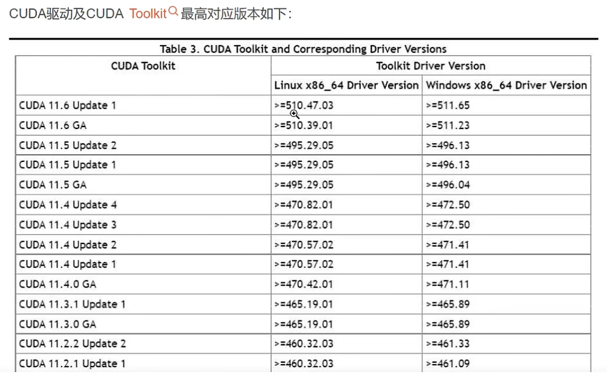

# cuda编程基础

### 1、cuda版本和驱动版本对应关系图


### 2、环境搭建篇
- 环境搭建 :  wsl2 + ubuntu18.04 +  cuda11.8
- 安装wsl：
    https://github.com/microsoft/WSL/releases/tag/2.4.13 
    下载 wsl.2.4.13.0.x64.msi

- 微软商店下载ubuntu18.04

- cuda官网：
    https://developer.nvidia.com/cuda-11-8-0-download-archive?target_os=Linux&target_arch=x86_64&Distribution=WSL-Ubuntu&target_version=2.0&target_type=deb_local
下载cuda 11.8 wsl2 .deb

- 设置环境变量： `vi ~/.bashrc` 添加以下内容：


```sh
# CUDA11.8
export PATH=/usr/local/cuda-11.8/bin:$PATH
export LD_LIBRARY_PATH=/usr/local/cuda-11.8/lib64:$LD_LIBRARY_PATH
```

- 此时可以识别 `nvcc --version` 但是 `nvidia-smi`无法识别
    - 执行：
    ```sh
    cp /usr/lib/wsl/lib/nvidia-smi /usr/bin/nvidia-smi
    chmod ogu+x /usr/bin/nvidia-smi
    ```
### 3、目录结构
- 代码相关均位于src/下，
```
src/
├── xxx.cu  # 源代码
├── clean_executa/  # 清理编译文件
│   └── clean_executable.sh
└── module/ # 模块
    └── GPU_Module.cuh
```